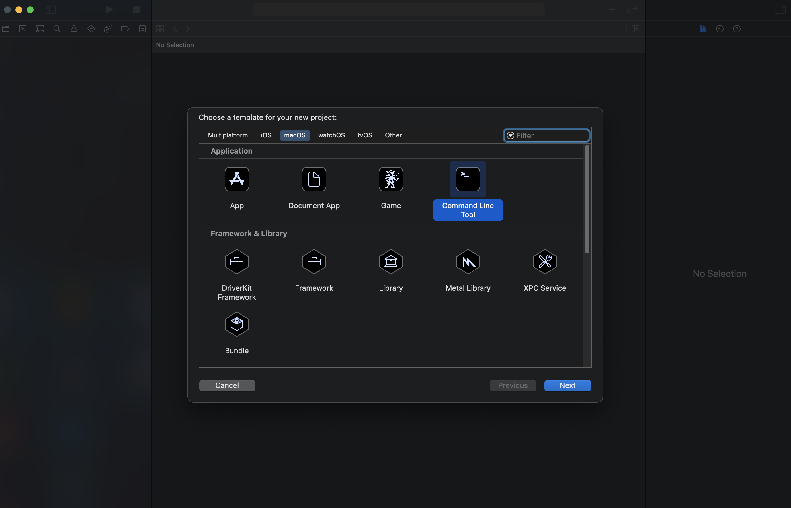
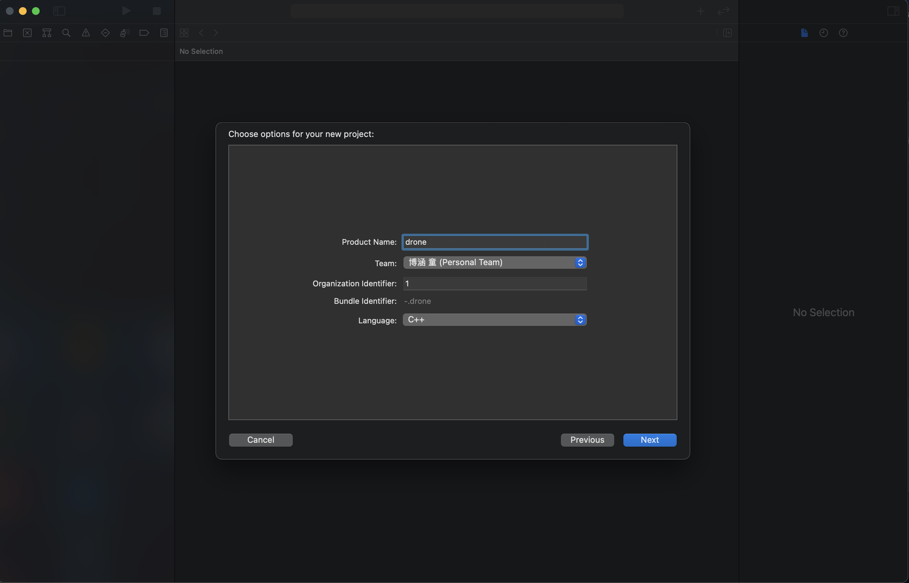
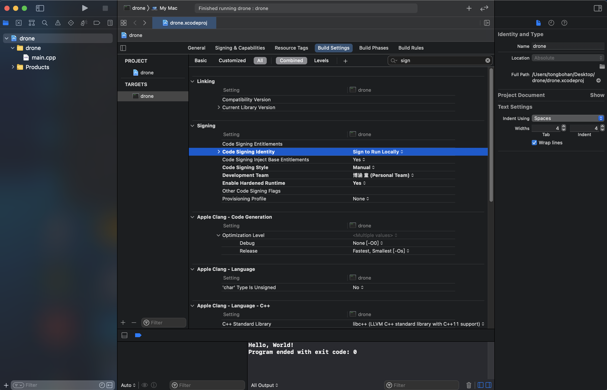
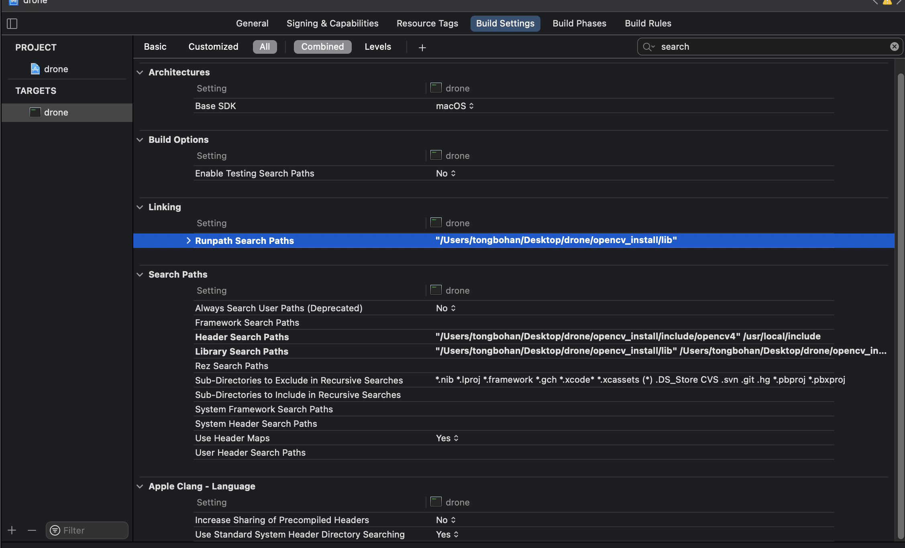
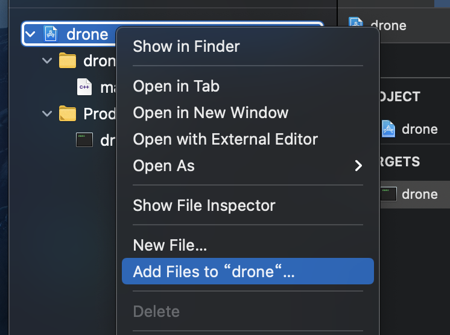
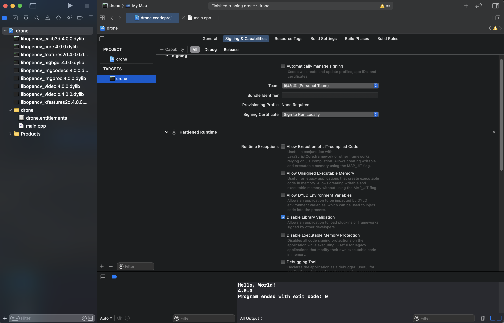
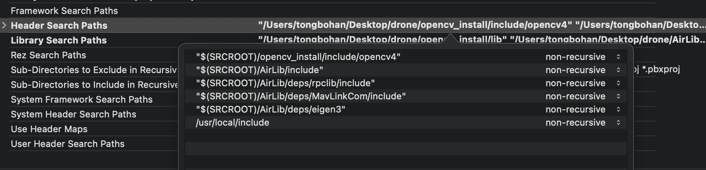
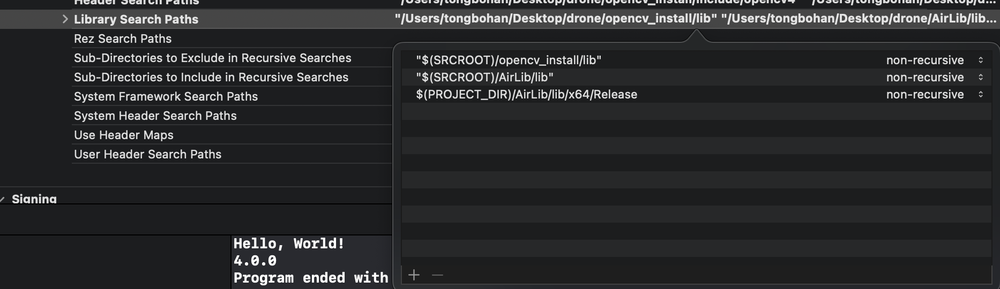
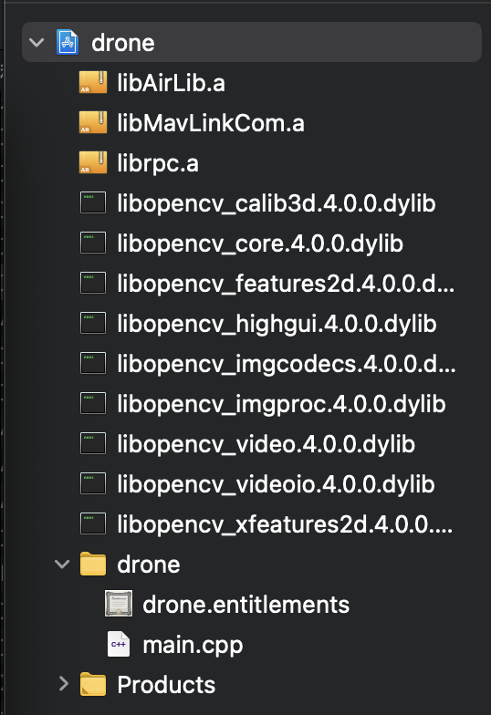
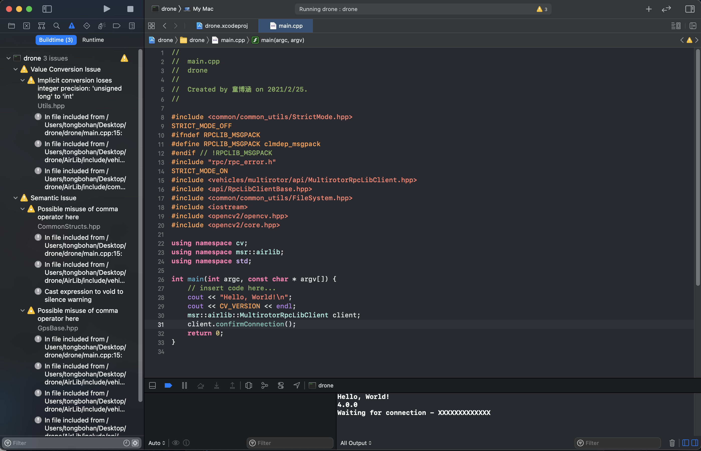

##  一. 工程的创建

本文为在MacOS+Xcode下构建Airsim+Opencv开发环境的记录。

环境：MacOS Big Sur 11.2.1, Opencv4.0.0, Xcode 12.4, AirLib 1.2。

### 1. 创建Xcode项目

打开Xcode，创建项目，选择macOS-Command Line Tool，点击next。

输入工程名，选择语言为C++，点击Next选择目录，创建成功。

直接点击RUN按钮，提示编译报错：

Warning: unable to build chain to self-signed root for signer "Apple Development:1308751722@qq.com(ATB42MMJFS)"/Users/tongbohan/Desktop/drone/Build/Products/Debug/drone: errSecInternalComponent

Command CodeSign failed with a nonzero exit code

解决方法：选择Build Settings，搜索Signing，在Code Signing Identity中选择Sign to Run Locally，在Code Signing Style中选择Manual，再次编译成功。(此问题可能是新版本的Xcode造成的，与开发者证书也有一定关系)

### 2. 添加Opencv库文件

选择Build Settings，在Search Paths下修改Header Search Paths和Library Search Paths(可以直接将Opencv编译安装时的include/Opencv4/Opencv2目录和lib目录直接拖进列表), 此外还需添加/usr/local/include目录。然后设置Runpath Search Paths，路径同为lib。

在工程的文件目录下，右键选择Add Files to "drone"，添加需要的Opencv .dylib库模块。

选择TARGETS- Signing&Capabilities- Hardened Runtime，点击Disable Library Validation，以取消库的验证。

若显示warning：Not a Doxygen trailing comment：Build Settings 搜索 Documentation Comments 设置成 No 则可。

### 3. 添加AirLib库文件

同步骤2，在Header Search Paths中添加AirLib/include、AirLib/deps/rpclib/include、AirLib/deps/MavLinkCom/include、AirLib/deps/eigen3目录。在 Library Search Paths中添加AirLib/lib/x64/Release目录。

在工程文件中添加三个静态库文件：libAirLib.a，libMavLinkCom.a，librpc.a

在Build Settings搜索Always Search User Paths（Deprecated），选择Yes

### 4.  运行&验证

运行程序，正常输出版本号4.0.0，Client初始化成功。

